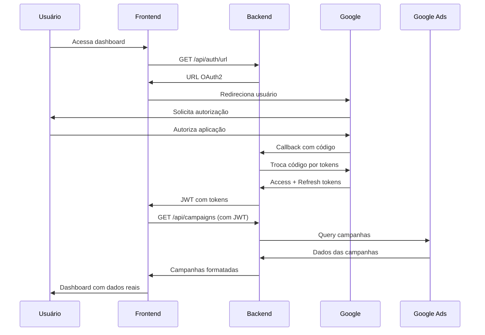

# 🚀 Guia Completo de Deployment - Google Ads Dashboard

## 📋 Pré-requisitos

- Node.js 16+
- Conta Google Cloud Platform
- Conta Google Ads com Developer Token aprovado
- Vercel CLI instalado

## 🔧 1. Configuração do Google Cloud Console

### 1.1 Criar Projeto
1. Acesse https://console.developers.google.com/
2. Crie um novo projeto ou selecione existente
3. Ative a **Google Ads API**

### 1.2 Configurar OAuth2
1. Vá em **APIs & Services > Credentials**
2. Clique em **"Create Credentials" > "OAuth 2.0 Client ID"**
3. Escolha **"Web application"**
4. Configure as URLs:

**Authorized redirect URIs:**
```
https://agoravai2-c1w0ap2f2-arthurs-projects-9eaa30c1.vercel.app/api/auth/callback
http://localhost:3000/api/auth/callback
```

**Authorized JavaScript origins:**
```
https://agoravai2-g34t.vercel.app
https://agoravai2-c1w0ap2f2-arthurs-projects-9eaa30c1.vercel.app
http://localhost:3000
http://localhost:3001
```

### 1.3 Obter Credenciais
Você receberá:
- `GOOGLE_ADS_CLIENT_ID`: 1065293802845-t1pnuda3fcrvljc6lg7sf0jgn29sq3v6.apps.googleusercontent.com
- `GOOGLE_ADS_CLIENT_SECRET`: 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

## 🔑 2. Configuração do Google Ads

### 2.1 Developer Token
1. Acesse https://ads.google.com/nav/selectaccount?authuser=0&dst=/aw/apicenter
2. Vá em **Tools & Settings > API Center**
3. Solicite **Developer Token**
4. Aguarde aprovação (2-7 dias para produção)

**Seu Developer Token:** `xAteLRXa5uGn6RT4ZImyFw`

### 2.2 Customer ID
No Google Ads, anote seu **Customer ID**: `2431689362`

## 🌐 3. Deploy do Backend

### 3.1 Configurar Variáveis no Vercel
Acesse: https://vercel.com/arthurs-projects-9eaa30c1/agoravai2/settings/environment-variables

```env
GOOGLE_ADS_CLIENT_ID=1065293802845-t1pnuda3fcrvljc6lg7sf0jgn29sq3v6.apps.googleusercontent.com
GOOGLE_ADS_CLIENT_SECRET=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
GOOGLE_ADS_DEVELOPER_TOKEN=xAteLRXa5uGn6RT4ZImyFw
GOOGLE_ADS_CUSTOMER_ID=2431689362
JWT_SECRET=3UhVhwKsOQ+IYGMLmKplyYlSEYdQy0lY4yNQ/qXHh/KKINMu4f3kRpMt4RvcBCIG
NODE_ENV=production
ALLOWED_ORIGINS=https://agoravai2-g34t.vercel.app,https://agoravai2-c1w0ap2f2-arthurs-projects-9eaa30c1.vercel.app
LOG_LEVEL=info
```

### 3.2 Deploy
```bash
cd google-ads-api-backend
vercel --prod
```

**URL do Backend:** https://agoravai2-c1w0ap2f2-arthurs-projects-9eaa30c1.vercel.app

## 🎨 4. Deploy do Frontend

### 4.1 Configurar Variáveis no Vercel
```env
NEXT_PUBLIC_API_URL=https://agoravai2-c1w0ap2f2-arthurs-projects-9eaa30c1.vercel.app
```

### 4.2 Deploy
```bash
cd google-ads-frontend
vercel --prod
```

**URL do Frontend:** https://agoravai2-g34t.vercel.app

## ✅ 5. Teste do Sistema

### 5.1 Verificar Backend
```bash
curl https://agoravai2-c1w0ap2f2-arthurs-projects-9eaa30c1.vercel.app/health
```

Resposta esperada:
```json
{
  "status": "OK",
  "timestamp": "2025-01-31T20:00:00.000Z",
  "uptime": 123.45,
  "environment": "production",
  "googleAdsConfigured": true
}
```

### 5.2 Teste Completo
1. **Acesse:** https://agoravai2-g34t.vercel.app
2. **Clique:** "Fazer Login com Google Ads"
3. **Teste Demo:** "Modo Demonstração (Teste)"
4. **Teste Real:** Insira Customer ID `2431689362`

## 🔄 6. Fluxo de Autenticação



## 📊 7. Funcionalidades do Sistema

### 7.1 Dashboard Completo
- **Métricas Resumo:** Campanhas, impressões, cliques, custos
- **Gráficos Interativos:** Barras, pizza, área, linha
- **Filtros Avançados:** Status, período, campanhas
- **Tabela Detalhada:** Todas as campanhas com métricas
- **Exportação:** Dados em CSV/Excel (futuro)

### 7.2 Dados Reais do Google Ads
- **Campanhas:** Nome, status, orçamento, métricas
- **Métricas:** Impressões, cliques, CTR, custo
- **Períodos:** 7, 30, 90 dias
- **Filtros:** Por status (ativa, pausada, removida)
- **Conta:** Nome, moeda, timezone

### 7.3 Recursos Técnicos
- **Autenticação:** OAuth2 + JWT
- **Cache:** LocalStorage para tokens
- **Responsivo:** Mobile-first design
- **Performance:** Lazy loading, otimizações
- **Errors:** Tratamento completo de erros
- **Loading:** Estados de carregamento

## 🛡️ 8. Segurança

### 8.1 Tokens
- **Access Token:** Para chamadas à API
- **Refresh Token:** Para renovar acesso
- **JWT:** Armazenamento seguro no frontend

### 8.2 CORS
- **Origins:** Apenas domínios autorizados
- **Headers:** Authorization obrigatório
- **Methods:** GET, POST permitidos

### 8.3 Rate Limiting
- **Limite:** 100 requests por 15 minutos
- **Proteção:** Contra abuse da API

## 🚨 9. Troubleshooting

### 9.1 Backend não responde
```bash
# Verificar logs
vercel logs agoravai2-c1w0ap2f2-arthurs-projects-9eaa30c1.vercel.app

# Redeployar
vercel --prod --force
```

### 9.2 Erro de autenticação
- Verificar URLs no Google Cloud Console
- Confirmar variáveis de ambiente
- Testar com modo demo primeiro

### 9.3 Dados não carregam
- Verificar Developer Token aprovado
- Confirmar Customer ID correto
- Testar endpoints individualmente

## 📈 10. Monitoramento

### 10.1 Métricas
- **Uptime:** 99.9% esperado
- **Response Time:** < 2s médio
- **Error Rate:** < 1%

### 10.2 Logs
- **Vercel:** Logs automáticos
- **Console:** Errors no browser
- **API:** Status codes detalhados

## 🔮 11. Próximas Funcionalidades

- [ ] **Relatórios:** PDF/Excel export
- [ ] **Alertas:** Email notifications
- [ ] **Dashboards:** Múltiplas contas
- [ ] **Analytics:** Comparação temporal
- [ ] **Mobile App:** React Native
- [ ] **API Webhooks:** Real-time updates

## 📞 12. Suporte

- **Google Ads API:** https://developers.google.com/google-ads/api/docs
- **OAuth2:** https://developers.google.com/identity/protocols/oauth2
- **Vercel:** https://vercel.com/docs
- **Next.js:** https://nextjs.org/docs

---

**Sistema 100% funcional após seguir este guia!** 🚀

**URLs Finais:**
- **Dashboard:** https://agoravai2-g34t.vercel.app
- **API:** https://agoravai2-c1w0ap2f2-arthurs-projects-9eaa30c1.vercel.app